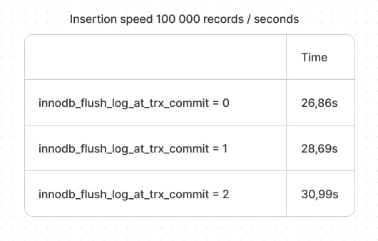
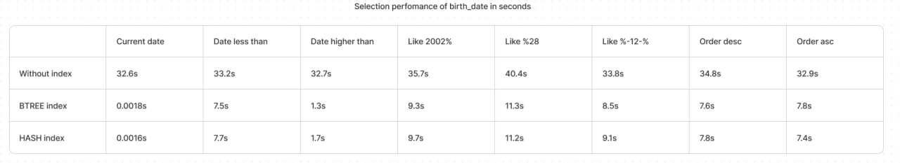

# MySQL Perfomance comparison

### Insertion comparison with different innodb_flush_log_at_trx_commit.

#### I was inserting with a 150 database connections and a 400 parallel threads.



### Selection perfomance comparison with different index.



# Note

You can run mariadb with command:

```bash
docker-compose up -d
```

In a folder named `source` all of the code i was using to compare all of the above.